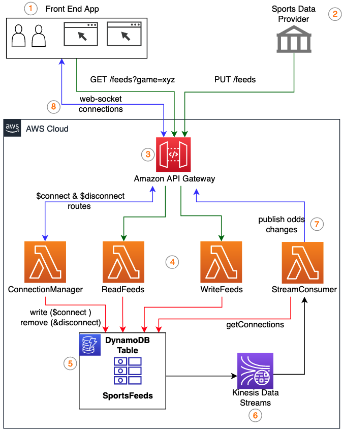

# Store & Stream sports data feeds using Amazon DynamoDB and Amazon Kinesis Data Streams

Online bookmakers are innovating to offer their clients continuously updated sports data feeds that allow betting throughout the duration of matches. In this post, we walk through a solution to ingest, store, and stream sports data feeds in near real-time using [Amazon API Gateway](https://aws.amazon.com/api-gateway/), [Amazon DynamoDB](https://aws.amazon.com/dynamodb/) and [Amazon Kinesis Data Streams](https://aws.amazon.com/kinesis/data-streams/).

In betting, odds represent the ratio between the amounts staked by parties to a bet. The odds for a given outcome of a sporting match change in response to events within the match. Sports data providers supply a variety of data feeds, such as game details and odds. Online bookmakers consume these data feeds to publish to their sports trading analysts. As odds change based on the events in the game, sports trading analysts use the continuously updated information from the data feeds to manage bets and odds. In order to remain competitive, bookmakers must provide updated odds to trading analysts in near-real time.

The solution presented in this post provides near real-time streaming of sports data feeds to a front-end application, allowing sports trading analysts to make decisions for online bookmakers based on the latest sports data feeds.


## Solution overview
The solution uses serverless services—which offload the undifferentiated heavy lifting aspects of infrastructure and maintenance to [Amazon Web Services (AWS)](https://aws.amazon.com/)—allowing you to focus on the application logic. Our solution has the following components: 

* __Sports data provider__ – External entities that provide on-field and off-field sports data feeds.
* __Backend database__ (DynamoDB)__ – The sports data feeds are stored in a DynamoDB table to support historical queries for charting and data retention purpose.
* __Application layer__ – [AWS Lambda](https://aws.amazon.com/lambda/) functions handle the application logic and reading and writing data into the DynamoDB table.
* __Front-end application__ – Renders the continuously changing sports data feeds for monitoring and analysis purposes.
* __API layer__ – Integrate the front-end application and sport data provider to the backend application. Amazon API Gateway provides an API layer for ingesting the data feeds from sports data providers using REST APIs.
* __Change data capture__ – To identify the continuously changing sports data feeds and stream to the front-end application. The changes to the sports data feeds are captured from Kinesis Data Streams for DynamoDB using a Lambda function and then published via WebSocket APIs to the front-end application.
* __WebSocket connection__ – Persistent connection from the front-end application to the API and backend application. API Gateway [WebSocket APIs](https://docs.aws.amazon.com/apigateway/latest/developerguide/apigateway-websocket-api.html) are used to achieve persistent connections to publish and display the continuously changing sports data feeds.
* __Sports trading analyst__ – The primary users of the solution that will be monitoring and analysing the sports data feeds using the front-end application. 

Data flow
The data flow in the solution can be divided into two flows:

__Flow A: Sports data provider to DynamoDB__
1.	The sports data provider continuously posts the sports data feeds. 
2.	API Gateway serves as a data ingestion layer for the sports data feeds. 
3.	Lambda functions implement the application logic to write the sports data feeds.
4.	DynamoDB handles the persistent storage of the sports data feeds.

__Flow B: DynamoDB to front-end application__

5.	Kinesis Data Streams captures the change records from the DynamoDB table when new feeds are inserted.
6.	The StreamConsumer Lambda function receives the change event record from the stream. 
7.	The odds feed data is published to the front-end application via WebSocket connections. 
8.	The sports trading analyst monitors and analyse the sports data feeds from the front-end application.

Figure 1 illustrates the solution architecture and the two flows described above

<figure>
  
  <figcaption align="center"> Figure 1 - Solution architecture and flow of sports data feeds </figcaption>
</figure>

<br />
To learn more about how this application works, review the Amazon DynamoDB Blog:

* [Store & Stream sports data feeds using Amazon DynamoDB and Amazon Kinesis Data Streams](https://aws.amazon.com/blogs)

Important: this application uses various AWS services and there are costs associated with these services after the Free Tier usage - please see the AWS Pricing page for details. You are responsible for any AWS costs incurred. No warranty is implied in this example.

```bash
.
├── README.MD              <-- This instructions file
├── bin                    <-- Combines the infrastructure and handlers into a single CDK app
├── images                 <-- Architecture diagram and images used for documentation
├── lambda                 <-- Lambda Functions for the application (NodeJS)
├── lib                    <-- Infrastructure stack shared across services 
├── scripts                <-- Script to simulate the sports data feeds

```

## Prerequisites
You must have the following prerequisites in place in order to deploy and test this solution: 

* An AWS account. ([Create an AWS account](https://portal.aws.amazon.com/gp/aws/developer/registration/index.html) if you do not already have one and login.)
* [AWS CLI](https://docs.aws.amazon.com/cli/latest/userguide/cli-chap-install.html) installed with Administrator permission
* [AWS CDK](https://docs.aws.amazon.com/cdk/latest/guide/getting_started.html#getting_started_install) installed
* [NodeJS 14.x or higher installed](https://nodejs.org/en/download/)
* [wscat installed](https://docs.aws.amazon.com/apigateway/latest/developerguide/apigateway-how-to-call-websocket-api-wscat.html)


## Deploy the solution
The following commands needs to be run on your local terminal to clone the repository, install all its dependencies and deploy the solution: 

1. Clone the repo onto your local development machine:
```
git clone https://github.com/aws-samples/amazon-dynamodb-store-stream-sports-data
```
2. Install AWS CDK & Dependencies
```
cd amazon-dynamodb-store-stream-sports-data

npm install -g aws-cdk

cdk --version

npm install --save-exact @aws-cdk/aws-lambda @aws-cdk/aws-lambda-nodejs @aws-cdk/aws-dynamodb @aws-cdk/aws-apigatewayv2 @aws-cdk/aws-kinesis @aws-cdk/aws-apigatewayv2-integrations @aws-cdk/aws-lambda-event-sources
```
3. Configure AWS Access Key and Secret Access Key:
```
aws configure
```
4. Bootstrap the AWS Account:
```
cdk bootstrap
```
5. Deploy all the AWS resources:
```
cdk deploy
```

## Testing the Solution
Now that we have the application deployed, the next step is to test the flows. Make a note of the API Gateway REST API stage URL for feedsAPI and WebSocket API stage URL for bookmakerAPI. We need them for testing. 

__Step 1__: Initialize with sample Game data :

The repository includes a script to initialize the table with some sample data for the Games and Client Entities. 
```
cd amazon-dynamodb-store-stream-sports-data/scripts
sh initDB.sh
```
__Step 2__: Start Client applications :

For simulating the client application we can make use of the wscat tool to create a WebSocket client connection request. You can create multiple sessions from different terminals to simulate multiple clients. Navigate to API Gateway Service to copy the bookmakerAPI WebSocket URL and update the below command. 

```
wscat -c <bookmakerAPI URL>?client=client-001
```
__Step 3__: Odds Feed Generator :

The repository provides a script that can be used for generating test odds feed for different games. 

```
cd amazon-dynamodb-store-stream-sports-data/scripts
sh oddsFeedGenerator.sh <feedsAPI URL> 
```
To post the odds feeds continuously you may use the below while loop.
```
while true; do sh oddsFeedGenerator.sh <feedsAPI URL> ; sleep 2; done
```
__Step 4__: Verification :

As the feeds are posted to the /odds API, you should verify: 

The web socket connection from the client gets persisted into the table.
```
aws dynamodb scan \
     --table-name sportsfeeds \
     --filter-expression "SK = :sk" \
     --expression-attribute-values '{":sk":{"S":"con"}}'
```
The ingested odds feeds are stored into the DynamoDB table. 
```
aws dynamodb scan \
     --table-name sportsfeeds \
     --filter-expression "begins_with(SK, :sk)" \
     --expression-attribute-values '{":sk":{"S":"odds-"}}'
```

The odds feeds should get published to the client sessions. For our testing use the wscat tool, that display the published odds. 


## Cleanup
To avoid incurring future charges, delete all the resources used in this solution. You can follow the below step to clean up the resources using CDK

```
cdk destroy
```

## Useful commands

 * `npm run build`   compile typescript to js
 * `npm run watch`   watch for changes and compile
 * `npm run test`    perform the jest unit tests
 * `cdk deploy`      deploy this stack to your default AWS account/region
 * `cdk diff`        compare deployed stack with current state
 * `cdk synth`       emits the synthesized CloudFormation template
 * `cdk destroy`     cleanup the stack created by CloudFormation template.


## Next steps

The AWS DynamoDB Blog at the top of this README file contains additional information about the application design and architecture.

If you have any questions, please contact the author or raise an issue in the GitHub repo.

==============================================

Copyright 2021 Amazon.com, Inc. or its affiliates. All Rights Reserved.

SPDX-License-Identifier: MIT-0
